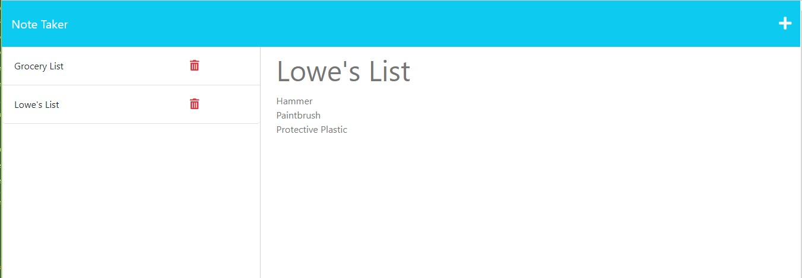

# Weekly Challenge 11 Create a note taker application.

## URL to Application

https://note-taker19971998.herokuapp.com/

## Description

The purpose of this project was to create a note taker application that provide a user the ability to save notes, view existing notes, and delete unwanted or completed notes. 

## Installation

N/A

## Usage

The note takerf application can be accessed at the URL listed at the top of the README.  A user can click the add note button to add a new note and save the note by clicking save.  A list of all the titles of saved notes will appear in the sidebar and the user can see the detail of any individual note by clicking the title of the note in the sidebar.  Finally, a user can delete a note by clicking the delete icon next to the note title in the sidebar.

## Credits

N/A

## License

Please refer to the LICENSE in the repo.

